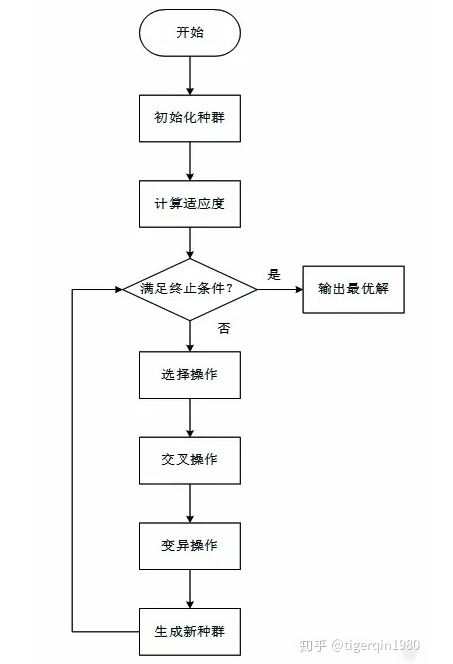

## week6
- 如何用遗传算法筛选特征
  - 使用`DEAP`  
  - 参考/[Github](https://github.com/kaushalshetty/FeatureSelectionGA)

  
## TODO
1. 更大规模的特征筛选
2. 如何用遗传算法计算特征权重
3. [Deap文档](https://deap.readthedocs.io/en/master/tutorials/basic/part1.html)

## week7
- 使用遗传算法回归
- `/deap/test.py`
- titanic deap
  - 参考/[kaggle](https://www.kaggle.com/michalgdak/gp-in-deap-with-cv-and-early-stopping#data)
- 官方文档
  - [example](https://deap.readthedocs.io/en/master/examples/gp_symbreg.html)
## TODO
- 调参，现在生成的表达式太短
    - 人口数
    - 迭代轮次
    - mutate和mate的概率
    - 选择最优的几个人口繁衍
    - 一开始生成树的树高
    - 变异设定的树高
    - 变异和交叉时是否有更好的方法？
- 生成表达式后如何自动转化成表达式？
